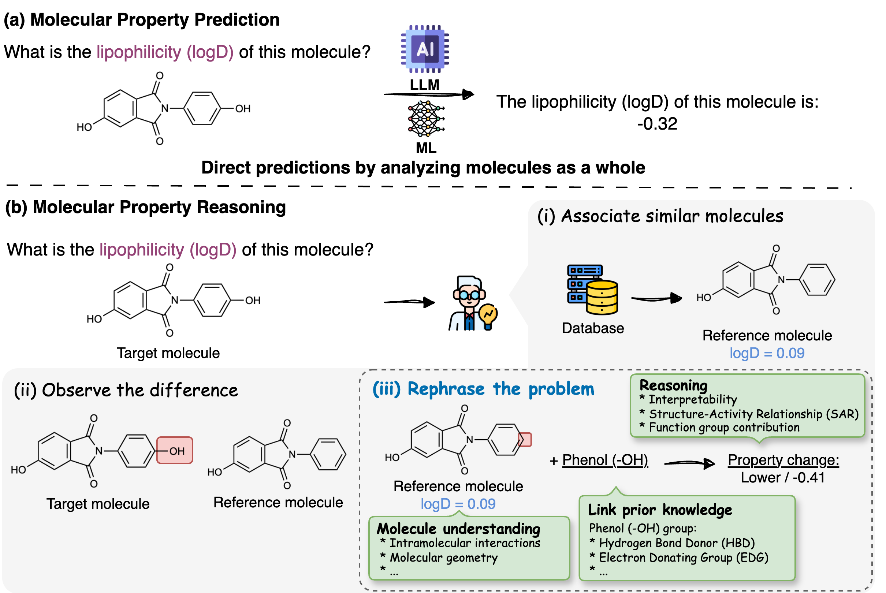
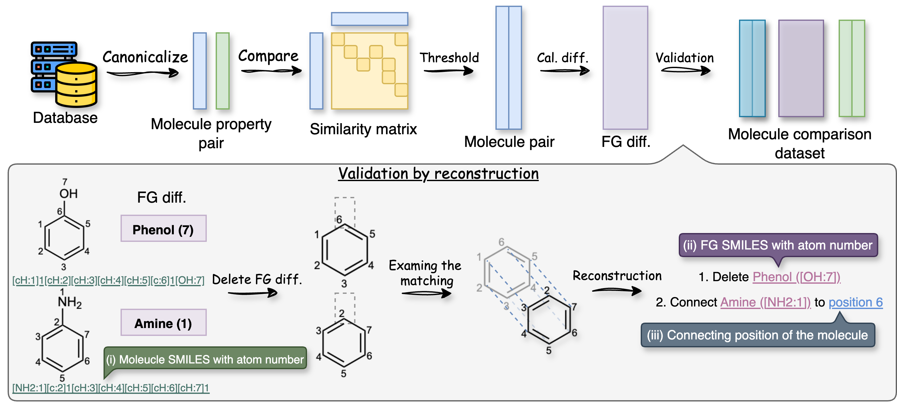
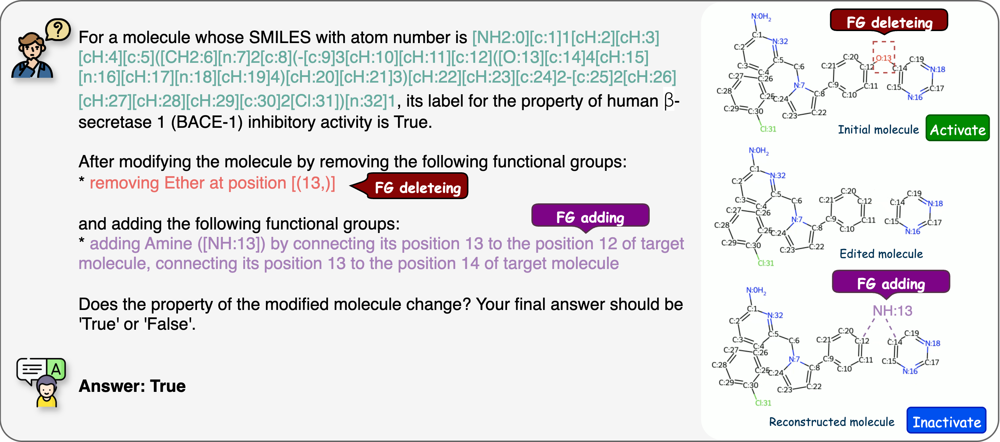
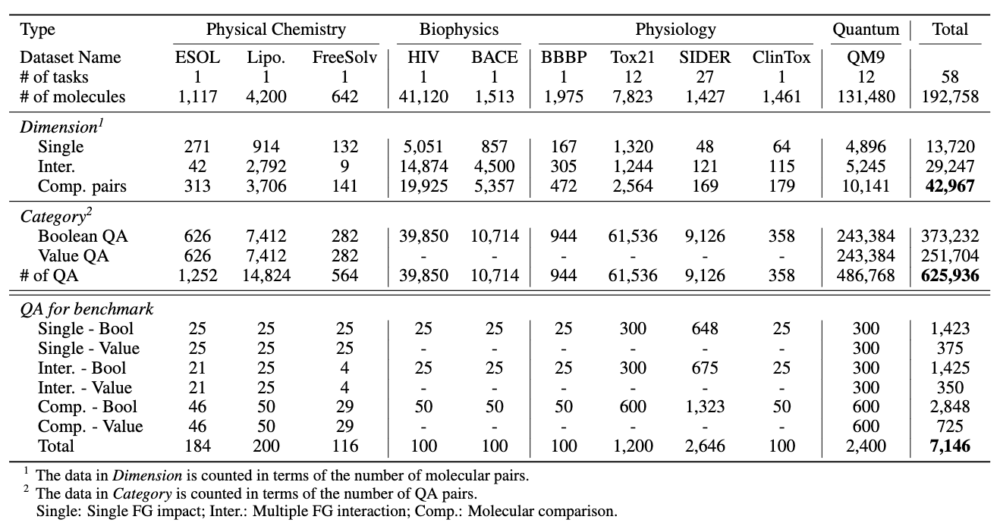

<div align="center">

# FGBench: A Dataset and Benchmark for Molecular Property Reasoning at Functional Group-Level in Large Language Models

[](https://huggingface.co/datasets/xuan-liu/FGBench/)
[](https://github.com/xuanliugit/FGBench)
[](https://www.arxiv.org/abs/2508.01055)


</div>

## News

* 2025.9: This work has been accepted by [NeurIPS 2025 D&B Track](https://neurips.cc/virtual/2025/poster/121617).

## Introduction
### Fine-grained molecular property reasoning like a chemist. 



### Gain FG knowlegde and data augmentation 



### Data example



### Dataset overview




## Quick start
### Usage 

```
from datasets import load_dataset
dataset = load_dataset("xuan-liu/FGBench") # Loading all 

dataset_test = load_dataset("xuan-liu/FGBench", split = "test") # Benchmark dataset

dataset_train = load_dataset("xuan-liu/FGBench", split = "train")
```

## Preparing your own dataset

### Step 1: Build FG comparison data
Your dataset should have two columns 'smiles' and 'y'. This step processes the FGs in molecules.

```python
from fgbench.build_dataset import build_smiles_property_df_from_csv, get_compare_df

dataset_name = 'YOUR_DATASET_NAME'
dataset_path = 'YOUR_DATASET_CSV_PATH'

smiles_property_df = build_smiles_property_df_from_csv(dataset_path)
smiles_property_df.to_csv(f'data/molnet/{dataset_name}.csv', index=False)
compare_df = get_compare_df(smiles_property_df)
compare_df.to_csv(f'data/molnet/{dataset_name}_compare.csv', index=False)
```

### Step 2: Build QA
This step builds QA based on `smiles_property_df` and `compare_df` prepared in Step 1.

In the `build_qa.py`, please indicate the dataset is a `regression` or `classification` task. It  will build corresponding QA for the dataset.

```python
from fgbench import build_qa

task_list = ['property 1', 'property 2', ...]

build_qa.run(dataset_name, task_list, 'regression') # for regression tasks
# Or run(dataset_name, task_list, 'classification') for classification tasks
```
This will save the QA jsonl file to `data/fgbench_qa/{dataset_name}.jsonl`

## Explanation of each column

| Name | Description |
|--------|-------------|
| `question` | Question used in FGBench about how functional group affect the property change |
| `answer` | The ground truth answer for the question |
| `target_smiles` | SMILES of target molecule, canonicalized by RDKit |
| `target_mapped_smiles` | SMILES of the target molecule with atom number, generated by RDKit. (SMILES will affect the order of atom number) |
| `ref_smiles` | SMILES of reference molecule, canonicalized by RDKit |
| `ref_mapped_smiles` | SMILES of the reference molecule with atom number, generated by RDKit |
| `target_diff` | Unique functional groups and alkanes in the target molecule with format: `[FG_list, alkane_list]`, `FG_list`: `[[FG_name, number, list_of_atom_list], ...]`. Example: `[[['Alkene', 1, [[1, 3]]]], [['C1 alkane', 2, [[0], [2]]]]]` |
| `ref_diff` | Unique functional groups and alkanes in the reference molecule with format: `[FG_list, alkane_list]`, `FG_list`: `[[FG_name, number, list_of_atom_list], ...]` |
| `disconnect_list` | Any group or alkane that will leave the target molecule. Example: `[['Ether', [[1]]], ['C1 alkane', [[0]]]]` |
| `connect_dict` | A dictionary of groups with its connecting site. Example: `{'C2 alkane ([CH2:7][CH3:8])': [[7, 6, 'target molecule']]}` |
| `target_label` | Ground truth label of target molecule on the `property_name` |
| `ref_label` | Ground truth label of reference molecule on the `property_name` |
| `property_name` | The property name |
| `type` | The Q&A type of this question |
| `dataset` | The dataset name |
| `task_num` | The task/column number of the dataset |
| `split` | Train/Test split label |

## Properties included in this database

This dataset is constructed with functional group information based on MoleculeNet dataset. The datasets and tasks used in FGBench are listed below.

```
regression_dataset_dict = {
    'esol':['log-scale water solubility in mols per litre'],
    'lipo':['octanol/water distribution coefficient (logD at pH 7.4)'],
    'freesolv':['hydration free energy in water'],
    'qm9':[
            'Dipole moment (unit: D)',
            'Isotropic polarizability (unit: Bohr^3)',
            'Highest occupied molecular orbital energy (unit: Hartree)',
            'Lowest unoccupied molecular orbital energy (unit: Hartree)',
            'Gap between HOMO and LUMO (unit: Hartree)',
            'Electronic spatial extent (unit: Bohr^2)',
            'Zero point vibrational energy (unit: Hartree)',
            'Heat capavity at 298.15K (unit: cal/(mol*K))',
            'Internal energy at 0K (unit: Hartree)',
            'Internal energy at 298.15K (unit: Hartree)',
            'Enthalpy at 298.15K (unit: Hartree)',
            'Free energy at 298.15K (unit: Hartree)'
            ]
}

classification_dataset_dict = {
    # Biophysics
    'hiv':['HIV inhibitory activity'], #1
    'bace': ['human β-secretase 1 (BACE-1) inhibitory activity'], #1
    # Physiology
    'bbbp': ['blood-brain barrier penetration'], #1
    'tox21': [
                "Androgen receptor pathway activation",
                "Androgen receptor ligand-binding domain activation",
                "Aryl hydrocarbon receptor activation",
                "Inhibition of aromatase enzyme",
                "Estrogen receptor pathway activation",
                "Estrogen receptor ligand-binding domain activation",
                "Activation of peroxisome proliferator-activated receptor gamma",
                "Activation of antioxidant response element signaling",
                "Activation of ATAD5-mediated DNA damage response",
                "Activation of heat shock factor response element signaling",
                "Disruption of mitochondrial membrane potential",
                "Activation of p53 tumor suppressor pathway"
            ], #12
    'sider': [
                "Cause liver and bile system disorders",
                "Cause metabolic and nutritional disorders",
                "Cause product-related issues",
                "Cause eye disorders",
                "Cause abnormal medical test results",
                "Cause muscle, bone, and connective tissue disorders",
                "Cause gastrointestinal disorders",
                "Cause adverse social circumstances",
                "Cause immune system disorders",
                "Cause reproductive system and breast disorders",
                "Cause tumors and abnormal growths (benign, malignant, or unspecified)",
                "Cause general disorders and administration site conditions",
                "Cause endocrine (hormonal) disorders",
                "Cause complications from surgical and medical procedures",
                "Cause vascular (blood vessel) disorders",
                "Cause blood and lymphatic system disorders",
                "Cause skin and subcutaneous tissue disorders",
                "Cause congenital, familial, and genetic disorders",
                "Cause infections and infestations",
                "Cause respiratory and chest disorders",
                "Cause psychiatric disorders",
                "Cause renal and urinary system disorders",
                "Cause complications during pregnancy, childbirth, or perinatal period",
                "Cause ear and balance disorders",
                "Cause cardiac disorders",
                "Cause nervous system disorders",
                "Cause injury, poisoning, and procedural complications"
            ], #27
    'clintox': ['drugs approved by the FDA and passed clinical trials'] # 1 task
    }
```

## Dataset Processing for MoleculeNet
```bash
python build_dataset.py [DATASET_NAME] # Build standard dataset 
python build_qa.py [DATASET_NAME] # Apply template to build QA
python split_qa.py # Split dataset to train and test
```

## Citation
```
@article{liu2025fgbench,
  title={FGBench: A Dataset and Benchmark for Molecular Property Reasoning at Functional Group-Level in Large Language Models},
  author={Liu, Xuan and Ouyang, Siru and Zhong, Xianrui and Han, Jiawei and Zhao, Huimin},
  journal={arXiv preprint arXiv:2508.01055},
  year={2025}
}
```
